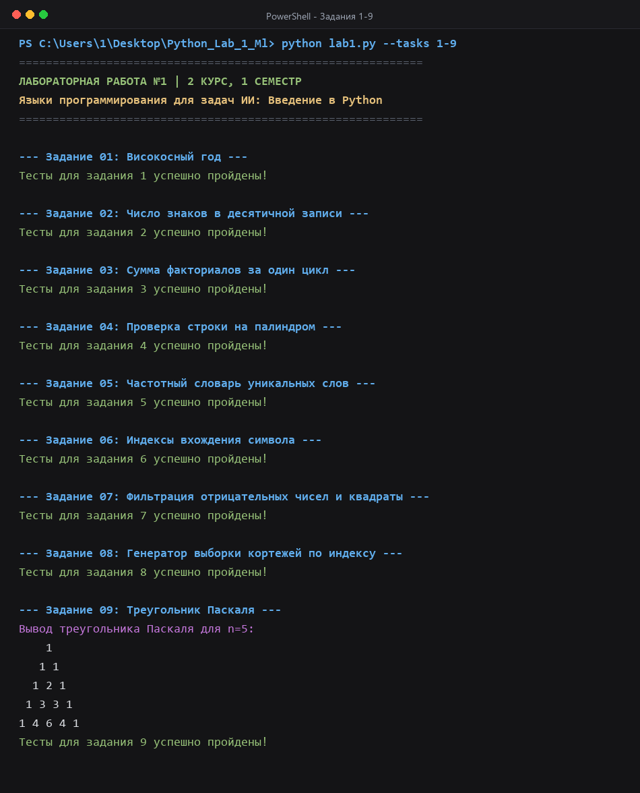
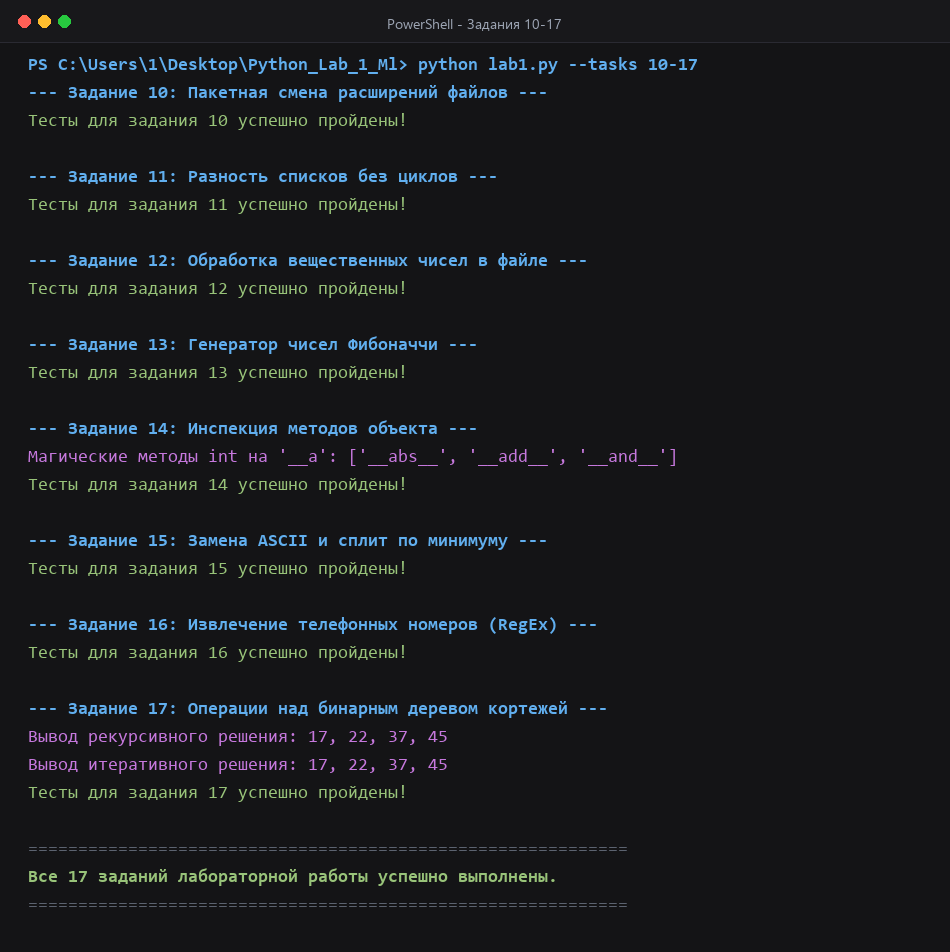

# Лабораторная работа №1: Введение в язык программирования Python

**Дисциплина:** Языки программирования для задач искусственного интеллекта  
**Курс:** 2 курс, 1 семестр  
**Студент:** Груздев Андрей Александрович (группа Б.ПИН.ИИ.25.16)  
**Преподаватель:** Елена Крутских  

---

## 1. Цель работы
Освоение базовых конструкций и идиом языка Python, стандартных структур данных, функциональных возможностей (генераторы, итераторы, функции высшего порядка), работы с файловой системой, регулярными выражениями и алгоритмами обработки иерархических структур данных (бинарных деревьев) в контексте задач искусственного интеллекта.

---

## 2. Структура проекта
```text
Python_Lab_1_Ml/
├── Languages_for_AI_Lection_01_Python_Intro_Lab01 (1).ipynb # Исходный интерактивный блокнот Jupyter
├── lab1.py                                                # Модульный Python-скрипт с тестами всех заданий
├── Отчет_Лабораторная_работа_1.docx                        # Полный академический отчет по ГОСТ
├── README.md                                              # Документация лабораторной работы
├── screenshots/                                           # Снимки экрана выполнения программы
│   ├── console_full.png                                   # Полный вывод консоли (17 заданий)
│   ├── console_tasks_1_9.png                              # Блок заданий 1–9
│   └── console_tasks_10_17.png                            # Блок заданий 10–17
├── scripts/
│   └── generate_screenshots.py                            # Скрипт регенерации снимков экрана
├── .gitignore                                             # Список исключений Git
└── requirements.txt                                       # Зависимости окружения
```

---

## 3. Содержание заданий

| № | Тема задания | Краткое описание решения |
|---|---|---|
| **1** | Определение високосного года | Проверка кратности 4, 100 и 400 по правилам григорианского календаря. |
| **2** | Число знаков в числе | Сравнение математического метода (`math.log10`) и строковой конвертации (`len(str)`). |
| **3** | Сумма факториалов $1!+\dots+n!$ | Реализация за один цикл с накоплением и функционально через `itertools.accumulate`. |
| **4** | Проверка на палиндром | Три решения: срез `s[::-1]`, метод двух указателей и встроенный `reversed()`. |
| **5** | Частотный словарь слов | Подсчет вхождений слов в тексте: через `collections.Counter` и ручной обход `dict.get()`. |
| **6** | Индексы вхождения символа | Поиск первого и последнего вхождения символа в строке (`find` и `rfind`). |
| **7** | Фильтрация и квадраты чисел | Удаление отрицательных чисел, возведение в квадрат и сортировка по убыванию: list comprehension, `filter`+`map`, цикл `for`. |
| **8** | Сортировка среза кортежей | Генераторная функция сортировки списка кортежей по произвольному индексу `itemgetter`. |
| **9** | Треугольник Паскаля | Построчное вычисление и форматированный центрированный вывод первых $n$ строк. |
| **10** | Пакетная смена расширений | Обход файлов директории и безопасное переименование расширений средствами `pathlib.Path`. |
| **11** | Разность двух списков | Получение уникальных элементов первого списка без циклов и генераторов (`dict.fromkeys` / `filter`). |
| **12** | Обработка чисел из файла | Игнорирование нечетных строк, прибавление минимума к четным строкам, запись с точностью 5 знаков. |
| **13** | Генератор Фибоначчи | Реализация конечного (до $n$) и бесконечного ($n = -1$) генератора последовательности Фибоначчи. |
| **14** | Инспекция методов объекта | Выборка магических методов (`__a` для `int`, `__s` для `str`, немагических для остальных) без циклов. |
| **15** | ASCII-замена и сплит | Замена заглавных букв на ASCII-коды, нахождение минимальной цифры и разбиение строки. |
| **16** | Парсинг телефонов (RegEx) | Извлечение мобильных номеров РФ регулярным выражением с поддержкой более 10 форматов записи. |
| **17** | Бинарное дерево кортежей | Рекурсивный и итеративный обходы дерева, вычисление суммы, глубины и сбалансированности. |

---

## 4. Инструкция по запуску

Для выполнения программы требуется Python 3.9+ (стандартная библиотека).

### Запуск через терминал:
```bash
python lab1.py
```

### Запуск через Jupyter Notebook:
```bash
jupyter notebook "Languages_for_AI_Lection_01_Python_Intro_Lab01 (1).ipynb"
```

---

## 5. Результаты тестирования

Все 17 заданий снабжены наборами `assert`-тестов. Ниже приведены снимки экрана с результатами успешного выполнения:

### Задания 1–9 (Базовые структуры, факториалы, палиндромы, генераторы, Паскаль):


### Задания 10–17 (Файлы, инспекция типов, регулярные выражения, бинарные деревья):


---

## 6. Выводы
В ходе выполнения лабораторной работы закреплены практические навыки программирования на Python, необходимые для дальнейшей работы с библиотеками анализа данных и машинного обучения:
- исследованы алгоритмические различия императивных и декларативных подходов к обработке последовательностей;
- изучено применение генераторов для эффективной работы с потенциально бесконечными потоками данных;
- освоено построение надежных регулярных выражений для нормализации строковых данных;
- реализованы рекурсивные и итеративные алгоритмы обработки древовидных структур данных.
